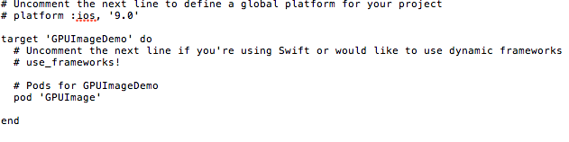

GPUImage学习-1、
1、新建一个Xcode工程，使用pods安装GPUImage。

2、导入#import "GPUImage.h"头文件。
3、1从现有图片中使用
	// 获取数据源
	UIImage *img = [UIImage imageNamed:@"lh"];
    GPUImagePicture *imagePicture = [[GPUImagePicture alloc]initWithImage:img];
    // 使用素描滤镜
    GPUImageSketchFilter *sketchFilter = [[GPUImageSketchFilter alloc]init];
//    GPUImageGaussianBlurFilter *sketchFilter = [[GPUImageGaussianBlurFilter alloc]init];
    [sketchFilter forceProcessingAtSize:img.size];
    [sketchFilter useNextFrameForImageCapture];
    // 添加滤镜
    [imagePicture addTarget:sketchFilter];
    // 开始渲染
    [imagePicture processImage];
    // 获取渲染后的图片
    UIImage *newImg = [sketchFilter imageFromCurrentFramebuffer];
    UIImageView *imgView = [[UIImageView alloc]initWithImage:newImg];
    imgView.frame = self.view.frame;
    [self.view addSubview:imgView];
   #111 
   